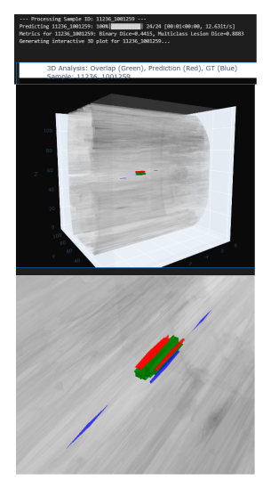
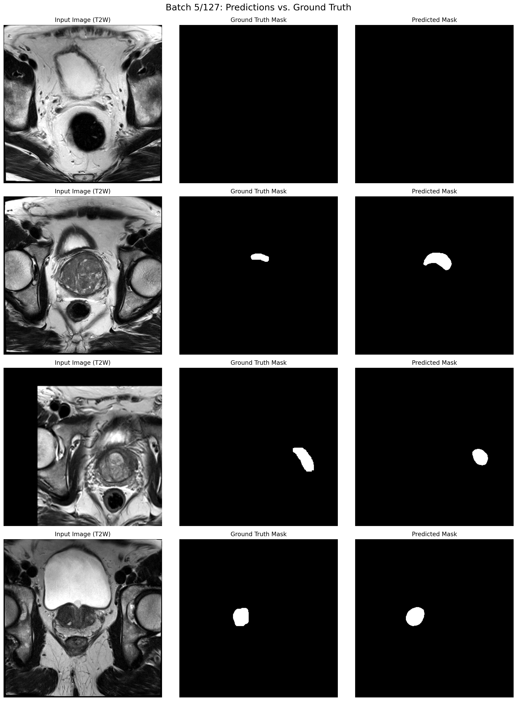

# Semi-supervised Multi-modal Multi-class Segmentation of Prostate Cancer in MRI using DeepLabV3+ (Google)
## Code: segmentation_pi_cai_project - multi-class.ipynb






## Data Processing

We used the **PI-CAI** dataset in this study. Since our main goal was to segment cancerous lesions, we only included the images that actually contain cancer. To find these images, we examined the metadata and selected the cases where the label `"csPCa"` is marked as `"YES"`. A case is labeled `"csPCa = YES"` only when the clinical significance score (csIUP) is 2 or higher.

After filtering, we obtained a total of **425 cancer-positive images**:
- **220 images** with expert-annotated segmentation masks.
- **205 images** without expert annotations.

Lesion labels range from 0 to 5. Therefore, we adopted a **multi-label segmentation** approach.

For each patient:
- **Three 3D volumes (.npy)** are used:
  - T2-weighted MRI (`t2w`)
  - Apparent Diffusion Coefficient (`adc`)
  - High b-value DWI (`hbv`)
- All files share the same shape: `(slices, height, width)`

### Preprocessing Pipeline
1. Load 3D arrays for all three modalities.
2. Extract 2D slices from the same index across all modalities.
3. Combine into a multi-channel 2D image: `(height, width, 3)`
4. Apply normalization and augmentations (random rotations, flips, etc.)
5. Convert to PyTorch tensor with shape `(3, height, width)`

| Step           | T2W (Shape)     | ADC (Shape)     | HBV (Shape)     | Combined (Shape) |
|----------------|------------------|------------------|------------------|-------------------|
| Load 3D        | (24, 384, 384)   | (24, 384, 384)   | (24, 384, 384)   | —                 |
| Extract 2D     | (384, 384)       | (384, 384)       | (384, 384)       | (384, 384, 3)     |
| Model Input    | —                | —                | —                | (3, 384, 384)     |

---

## Dataset Construction

- **Train/Validation Split**: 80/20
  - Training: 176 3D cancer-positive images
  - Validation: 44 3D cancer-positive images (used for testing)
- Each 3D volume is sliced into 2D images.
- Both **lesion (positive)** and **background (negative)** slices are included.
- **Augmentation**:
  - Training: random rotations, flips, brightness, noise.
  - Validation: only resizing.

---

## Model

- **Architecture**: DeepLabV3+ with ResNet-101 backbone
- **Pretrained** weights used (ImageNet)
- **Loss Function**: `CrossEntropyLoss`
- **Optimizer**: Adam
- **Mixed Precision**: Enabled if using CUDA

---

## Stage 1: Supervised Training

- Train the model on the **176 labeled images**.
- Save the model checkpoint with best validation Dice score.
- Use early stopping if validation performance plateaus.

**Training loop**:
- Input: batches of 2D augmented slices
- Output: predicted segmentation mask
- Metrics computed after each epoch:
  - Binary and Multiclass Dice scores

---

## Pseudo-Label Generation

- Load best model from Stage 1.
- For each **unlabeled patient (205)**:
  - Extract and preprocess each 2D slice.
  - Predict segmentation mask.
  - Resize mask back to original.
  - Remove small noisy regions.
  - Stack masks into 3D pseudo-label and save as `.npy`

---

## Stage 2: Semi-Supervised Training

- Combine:
  - 176 labeled images
  - 205 unlabeled images with pseudo-labels
- Total training set: **381 images**
- Retrain DeepLabV3+ on combined dataset.
- Validation performed on the original 44 validation cases.

---

## Evaluation

### Final 2D Slice-Level Metrics
- **Multiclass Dice**: `0.2010`
- **Binary Dice**: `0.3970`
- **AUROC**: `0.9942`
- **Average Precision (AP)**: `0.5013`

### Final 3D Case-Level Metrics
- **Multiclass Dice (Lesions Only)**: `0.6029`
- **Binary Dice**: `0.3676`
- **AUROC**: `0.9924`
- **Average Precision (AP)**: `0.4145`

### Supervised Baseline
- **Validation Multiclass Dice**: `0.1928`
- **Validation Binary Dice**: `0.3436`


## Dataset Characteristics
This dataset contains 1500 anonymized prostate biparametric MRI scans from 1476 patients, acquired between 2012-2021, at three centers (Radboud University Medical Center, University Medical Center Groningen, Ziekenhuis Groep Twente) based in The Netherlands. 


|                                |                 |
|--------------------------------|-----------------|
| Number of sites                | 11              |
| Number of MRI scanners         | 5 S, 2 P        |
| Number of patients             | 1476            |
| Number of cases                | 1500            |
| — Benign or indolent PCa       | 1075            |
| — csPCa (ISUP ≥ 2)             | 425             |
| Median age (years)             | 66 (IQR: 61–70) |
| Median PSA (ng/mL)             | 8.5 (IQR: 6–13) |
| Median prostate volume (mL)    | 57 (IQR: 40–80) |
| Number of positive MRI lesions | 1087            |
| — PI-RADS 3                    | 246 (23%)       |
| — PI-RADS 4                    | 438 (40%)       |
| — PI-RADS 5                    | 403 (37%)       |
| Number of ISUP-based lesions   | 776             |
| — ISUP 1                       | 311 (40%)       |
| — ISUP 2                       | 260 (34%)       |
| — ISUP 3                       | 109 (14%)       |
| — ISUP 4                       | 41 (5%)         |
| — ISUP 5                       | 55 (7%)         |

Abbreviations:
- S: Siemens Healthineers
- P: Philips Medical Systems
- PCa: prostate cancer
- csPCa: clinically significant prostate cancer

## Hyperparamters
| **Parameter**           | **Value**              | **Description**                                      |
|-------------------------|------------------------|------------------------------------------------------|
| DEVICE                  | "cuda"/"cpu"           | Use GPU if available, else CPU                      |
| IMAGE_SIZE              | 384                    | Image size for resizing (height and width)          |
| BATCH_SIZE              | 8                      | Batch size for training                             |
| LEARNING_RATE_S1        | 1e-4                   | Learning rate for Stage 1 (supervised training)     |
| LEARNING_RATE_S2        | 5e-5                   | Learning rate for Stage 2 (semi-supervised training)|
| NUM_EPOCHS_STAGE_1      | 50                     | Number of epochs for Stage 1                        |
| NUM_EPOCHS_STAGE_2      | 50                     | Number of epochs for Stage 2                        |
| VALIDATION_SPLIT        | 0.2                    | Fraction of data used for validation                |
| MIN_LESION_AREA         | 50                     | Minimum lesion area for post-processing             |
| NUM_CLASSES             | 6                      | Number of segmentation classes                      |

| **Parameter / Info**        | **Value / Description**                                                                 |
|----------------------------|------------------------------------------------------------------------------------------|
| Device                     | "cuda" if available, else "cpu"                                                         |
| Image Size                 | 384 (images resized to 384x384)                                                         |
| Batch Size                 | [4, 8, 16]                                                                               |
| Learning Rate (Stage 1)    | 1e-4 (supervised training)                                                              |
| Learning Rate (Stage 2)    | 5e-5 (semi-supervised training)                                                         |
| Epochs (Stage 1)           | 50                                                                                      |
| Epochs (Stage 2)           | 50                                                                                      |
| Num Workers                | 0 (for DataLoader)                                                                      |
| Pin Memory                 | True (for DataLoader)                                                                   |
| Validation Split           | 0.2 (20% for validation)                                                                |
| Min Lesion Area            | 50 (for post-processing)                                                                |
| Num Classes                | 6 (multi-class segmentation)                                                            |
| Model                      | DeepLabV3+ (ResNet-101 backbone, output channels = 6)                                   |
| Modalities                 | T2W, ADC, HBV (multi-modal input, stacked as channels)                                  |
| Augmentation               | Resize, rotation (±15°), horizontal/vertical flip, brightness/contrast, Gaussian noise  |
| Normalization              | Per-channel percentile clipping (1st–99th), then min-max normalization to [0, 1]        |
| Loss Function              | CrossEntropyLoss                                                                        |
| Optimizer                  | Adam                                                                                    |
| Early Stopping             | Patience = 10 epochs without improvement                                                |
| Labeled Data Dir           | `input/processed_resampled3`                                                            |
| Unlabeled Data Dir         | `input/processed_incomplete_cases`                                                      |
| Output Dir                 | `models/semisupervised_output/multi_class_trial4`                                       |
| Pseudo-mask Dir            | `<output_dir>/pseudo_masks`                                                             |
| Stage 1 Model Path         | `<output_dir>/best_supervised_model.pth`                                                |
| Final Model Path           | `<output_dir>/best_semisupervised_model.pth`                                            |
| Pseudo-labeling            | Generates pseudo-masks for unlabeled data using best Stage 1 model                      |
| Training Pipeline          | Stage 1: supervised → pseudo-label generation → Stage 2: semi-supervised                |
| Post-processing            | Removes small lesions below MIN_LESION_AREA for each class                              |
| Validation Loader          | Balanced (equal positive/negative slices) for fair evaluation                           |

## Imaging Files

Imaging sequences are mapped to filenames in the following way:

* Axial T2-weighted imaging (T2W): `[patient_id]_[study_id]_t2w.mha`
* Axial high b-value (≥ 1000 s/mm2) diffusion-weighted imaging (HBV): `[patient_id]_[study_id]_hbv.mha`
* Axial apparent diffusion coefficient maps (ADC): `[patient_id]_[study_id]_adc.mha`
* Sagittal T2-weighted imaging: `[patient_id]_[study_id]_sag.mha`
* Coronal T2-weighted imaging: `[patient_id]_[study_id]_cor.mha`

Every patient case will at least have three imaging sequences: axial T2W, axial HBV and axial ADC scans (i.e., files ending in `_t2w.mha`, `_hbv.mha`, `_adc.mha`). Additionally, they can have either, both or none of the sagittal and coronal T2W scans (i.e., files ending in `_sag.mha`, `_cor.mha`).


## Folder Structure

```
images  (root folder with all patients, and in turn, all 1500 studies)
├── ...
├── 10417  (patient-level folder, including all studies for a given patient)
	├── 10417_1000424_t2w.mha  (axial T2W imaging for study 1000424)
	├── 10417_1000424_adc.mha  (axial ADC imaging for study 1000424)
	├── ...
	├── 10417_1000425_t2w.mha  (axial T2W imaging for study 1000425)
	├── 10417_1000425_adc.mha  (axial ADC imaging for study 1000425)
	├── ...
├── ...
```


## Annotations for Dataset
See [https://github.com/DIAGNijmegen/picai_labels](https://github.com/DIAGNijmegen/picai_labels).
